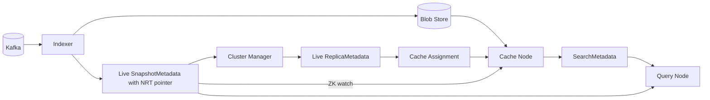
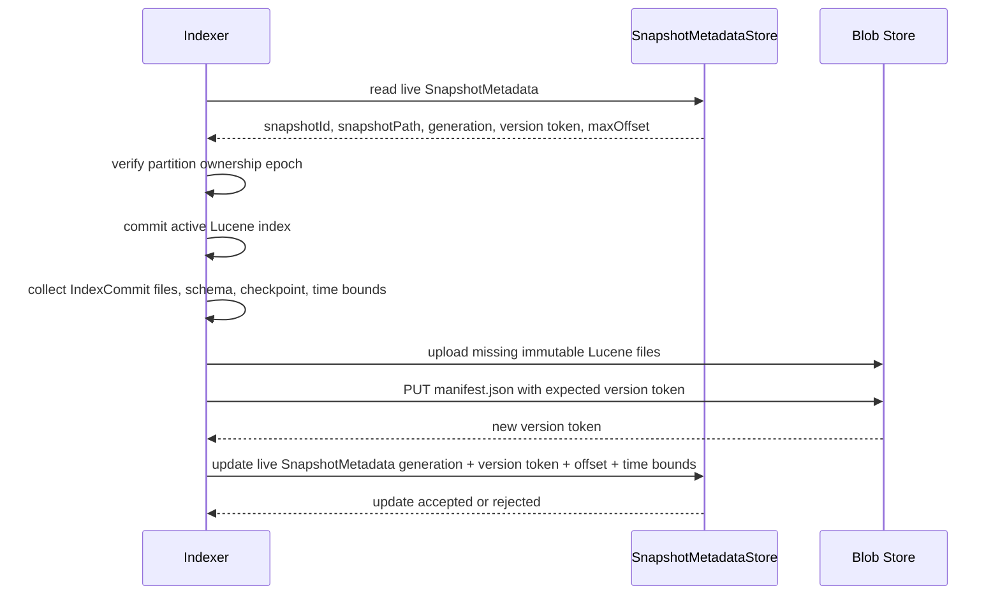
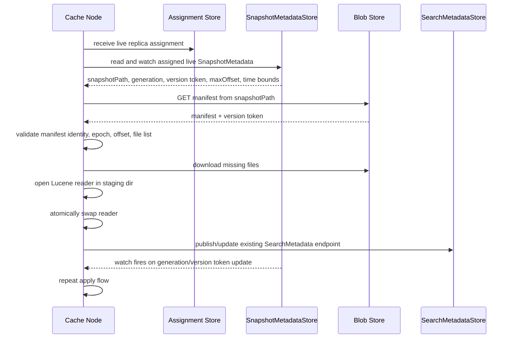
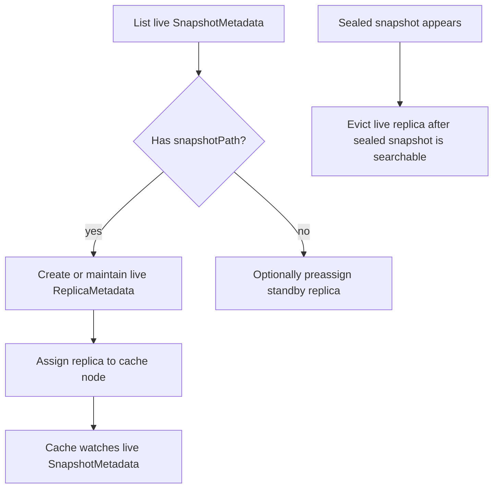

# NRT Segment Replication Design

## Status

Draft.

This document expands `docs/adr/nrt_adr.md` into an implementation design for near-real-time
Lucene segment replication. It describes the intended design, not the current experimental branch.

## Problem

KalDB indexers serve fresh data from an active Lucene chunk. When the chunk rolls over, the indexer
publishes an immutable snapshot to S3 and cache nodes serve it through the existing replica
assignment flow.

If an indexer fails before the active chunk is finalized, indexed data is durable in Kafka but not
available from cache until recovery replays Kafka, rebuilds Lucene, publishes a snapshot, and cache
nodes load it. NRT replication reduces that unavailable window to the configured replication lag
plus cache failover time.

## Goals

- Replicate active-indexer Lucene commit points to blob storage before final snapshot publication.
- Use the existing snapshot, replica, assignment, and search metadata flows where possible.
- Let cache nodes keep assigned standby copies of active chunk data.
- Publish only complete and consistent Lucene commit points.
- Use ZooKeeper watches so cache nodes react to live snapshot pointer changes.
- Fence stale indexers with a writer epoch or equivalent ownership token.
- Keep finalized immutable snapshots as the source of truth after rollover.
- Preserve the current recovery path as fallback.

## Non-Goals

- Cache nodes do not become Lucene writers.
- Replication is not synchronous per Kafka record.
- Query nodes do not download or host Lucene data.
- This design does not require changing the finalized snapshot storage format.
- This design does not promise exactly-zero unavailability.

## Decision Summary

1. Extend `SnapshotMetadata` instead of adding a separate `NrtChunkMetadata` object.
2. Represent active chunks as `SnapshotMetadata` with `snapshotType = LIVE`.
3. Store a stable NRT manifest path in the live `SnapshotMetadata.snapshotPath`.
4. The cluster manager creates normal replica metadata for live snapshots, just as it does for
   sealed snapshots.
5. Cache nodes load assigned live replicas, set a watch on the live `SnapshotMetadata` znode, and
   refresh when the NRT generation or blob version token changes.
6. The indexer uploads immutable Lucene files, conditionally overwrites the stable manifest, then
   updates the live `SnapshotMetadata` with the new generation, version token, and checkpoint.
7. Cache nodes publish searchable endpoints through the existing `SearchMetadata` mechanism after
   they successfully open the replicated Lucene reader.
8. Query planning uses the existing searchable snapshot endpoints and must choose one serving
   source for each active chunk to avoid duplicate live-indexer plus NRT-cache results.

## Metadata Direction

The foundation is an expanded `SnapshotMetadata` model:

```text
SnapshotMetadata {
  snapshotId
  snapshotType = LIVE | SEALED
  indexType = LUCENE | ...
  snapshotPath
  snapshotGeneration
  snapshotVersionToken
  startTimeEpochMs
  endTimeEpochMs
  partitionId
  maxOffset
  sizeInBytesOnDisk
  version
}
```

For sealed snapshots, `snapshotPath` points to the immutable snapshot root.

For live snapshots, `snapshotPath` points to the stable NRT manifest object for that active chunk.
`snapshotGeneration` is the latest published NRT generation. `snapshotVersionToken` is the generic
blob-store version returned by the manifest conditional write. For S3 this is an ETag or object
version; for other blob stores it is the equivalent conditional-update token.

Updating `snapshotGeneration`, `snapshotVersionToken`, offset, or time bounds on the live snapshot
is the watchable handoff from the indexer to assigned cache nodes. `snapshotPath` should not change
for every generation.

No separate NRT metadata object is required for the first implementation. The main reason is that
ZooKeeper already gives cache nodes watches on snapshot metadata updates, and the existing replica
assignment path already knows how to assign work by snapshot ID. Keeping NRT state on live
`SnapshotMetadata` avoids a second metadata object whose lifecycle must be reconciled with the live
snapshot.

## Current Model

```text
Kafka -> Indexer active chunk -> queryable on indexer
Kafka -> Indexer finalized chunk -> S3 snapshot -> replica assignment -> queryable on cache
Kafka -> Recovery indexer -> S3 snapshot -> replica assignment -> queryable on cache
```

## Proposed Model

```text
Kafka -> Indexer active chunk
  -> live SnapshotMetadata
  -> live ReplicaMetadata
  -> cache assignment
  -> cache watches live SnapshotMetadata generation/version token
  -> cache downloads stable NRT manifest from S3
  -> cache refreshes Lucene reader
  -> cache publishes existing SearchMetadata endpoint
```



Control responsibilities:

- Indexer writes Lucene files and the stable manifest to blob storage.
- Indexer updates live `SnapshotMetadata.snapshotGeneration`, `snapshotVersionToken`, `maxOffset`,
  and time bounds after a valid NRT point is durable.
- Cluster manager creates and assigns replicas for live snapshots.
- Cache nodes watch assigned live snapshot metadata and refresh from the pointed NRT state.
- Cache and indexer nodes publish searchable endpoints through existing `SearchMetadata`.
- Query nodes stay stateless and choose serving URLs from metadata.

## Replication Unit

The replication unit is one active chunk for one dataset partition.

Identity:

```text
dataset/topic
partitionId
chunkId / snapshotId
writerEpoch
```

The active chunk is represented by a live `SnapshotMetadata` entry. Its assigned cache replicas use
the same snapshot ID as the unit of work.

## Blob Layout

Use a stable prefix per active chunk and immutable file objects under that prefix.

```text
nrt/v1/partitions/<partitionId>/chunks/<chunkId>/
  manifest.json
  files/<luceneFileName>
```

The live snapshot's `snapshotPath` points to the stable manifest object:

```text
nrt/v1/partitions/0/chunks/chunk-abc/manifest.json
```

Rules:

- Lucene files are immutable once uploaded.
- There is exactly one manifest object per live chunk.
- The manifest object is overwritten through a conditional blob-store write using
  `snapshotVersionToken`.
- Readers must not infer latest state by listing blob storage.
- The live `SnapshotMetadata.snapshotPath` is stable across generations.
- The live `SnapshotMetadata.snapshotGeneration` and `snapshotVersionToken` identify the latest NRT
  point cache nodes should load.
- Updating `SnapshotMetadata` happens only after all files and the manifest are uploaded
  successfully.

The blob-store API must expose a generic conditional write primitive. The implementation should not
name this field `etag` in metadata because not all object stores use ETags. Use a generic name such
as `snapshotVersionToken` or `blobVersionToken`.

## Manifest Schema

The manifest represents one complete Lucene commit point for one active chunk.

```json
{
  "version": 1,
  "snapshotId": "chunk-abc",
  "partitionId": "0",
  "writerNodeId": "indexer-0",
  "writerEpoch": 42,
  "manifestGeneration": 2,
  "createdAtEpochMs": 1700000060000,
  "luceneCommitGeneration": 4,
  "startOffsetInclusive": 1000,
  "maxIndexedOffsetInclusive": 2300,
  "startTimeEpochMs": 1700000000000,
  "endTimeEpochMs": 1700000059000,
  "schemaFile": {
    "name": "schema",
    "key": "nrt/v1/partitions/0/chunks/chunk-abc/files/schema",
    "length": 1024,
    "checksum": "object-or-content-checksum"
  },
  "files": [
    {
      "name": "_0.cfe",
      "key": "nrt/v1/partitions/0/chunks/chunk-abc/files/_0.cfe",
      "length": 12345,
      "checksum": "object-or-content-checksum"
    },
    {
      "name": "segments_4",
      "key": "nrt/v1/partitions/0/chunks/chunk-abc/files/segments_4",
      "length": 456,
      "checksum": "object-or-content-checksum"
    }
  ]
}
```

Field meanings:

- `version`: manifest schema version.
- `manifestGeneration`: monotonic sequence for this live snapshot.
- `writerEpoch`: current partition ownership epoch or equivalent fencing token.
- `maxIndexedOffsetInclusive`: recovery checkpoint for this Lucene commit.
- `startTimeEpochMs` and `endTimeEpochMs`: query planning and chunk filtering bounds.
- `schemaFile`: schema needed to open/query the local read-only chunk.
- `files`: complete Lucene file set needed to open this commit.

The Kafka checkpoint must be written into Lucene commit metadata before publishing the manifest, so
the manifest and Lucene commit describe the same ingest point.

## Publisher Flow



Publisher steps:

1. Confirm the active chunk still has live `SnapshotMetadata`.
2. Confirm this indexer still owns the partition epoch.
3. Commit the active Lucene index.
4. Collect the `IndexCommit` file list, schema file, checkpoint, and time bounds.
5. Upload missing immutable Lucene files.
6. Overwrite the stable manifest object with a conditional blob-store write using the previous
   `snapshotVersionToken`. The first publish uses a create-if-absent conditional write.
7. Update live `SnapshotMetadata.snapshotGeneration`, `snapshotVersionToken`, `maxOffset`,
   `startTimeEpochMs`, and `endTimeEpochMs`.
8. Stop and retry on the next tick if the metadata update is rejected.

Metadata update rules:

- The new offset must not move backward.
- The new manifest generation must be greater than the previous `snapshotGeneration`.
- The new `snapshotVersionToken` must be the token returned by the successful manifest write.
- The writer epoch must match current partition ownership.
- `snapshotType` remains `LIVE` until rollover publishes the sealed snapshot.

Failure behavior:

- File upload failure: do not upload the manifest and do not update `SnapshotMetadata`.
- Manifest upload failure: do not update `SnapshotMetadata`.
- Manifest conditional write failure: stop and reload live `SnapshotMetadata` on the next tick.
- Metadata update failure after manifest upload: next tick reconciles by reading the manifest and
  current blob version token. If the manifest belongs to the same snapshot and has a newer
  generation than metadata, repair `SnapshotMetadata`.
- Stale indexer loses the metadata update because ownership validation fails.

## Cache Consumption Flow



Cache node rules:

- Follow only assigned live replicas.
- Set a ZooKeeper watch on the assigned live `SnapshotMetadata`.
- Load only the manifest referenced by `SnapshotMetadata.snapshotPath`.
- Verify the blob-store version token returned by the manifest read matches
  `SnapshotMetadata.snapshotVersionToken`.
- Reject manifests whose snapshot ID, partition, writer epoch, offset, generation, or blob version
  token do not match expectations.
- Download only missing files, but validate every manifest file by existence, length, and checksum
  before opening a reader.
- Keep the previous known-good reader serving until the new reader opens.
- Publish or update `SearchMetadata` only after reader open succeeds.

## Manager Discovery And Assignment

Cluster manager should treat live snapshots as assignable when NRT replication is enabled.



Manager responsibilities:

- Discover active chunks from live `SnapshotMetadata`.
- Create live replicas using the existing `ReplicaMetadata` and assignment flow.
- Assign live replicas according to NRT replica count.
- Evict live replica assignments after the sealed snapshot is searchable.
- Reconcile abandoned live replicas whose live snapshot no longer exists.

## Query Planning

Cache and indexer nodes already publish searchable endpoints for chunks they serve. NRT should use
that same `SearchMetadata` mechanism rather than introducing another publish path.

Selection order per partition/chunk coverage range:

1. Sealed immutable snapshot cache replica, if searchable.
2. Healthy live indexer serving the active chunk.
3. Searchable live-snapshot cache replica loaded from the NRT point.
4. Existing recovery fallback when no searchable source exists.

The query layer must not query the live indexer and NRT cache for the same live snapshot unless it
also has a deduplication strategy. The initial design avoids duplicates by selecting one source.

The existing searchable endpoint metadata must be sufficient to group candidates by snapshot ID,
partition, time range, and endpoint. If it is not, extend the existing search metadata model rather
than creating an NRT-specific search publication path.

## Snapshot Finalization

When an active chunk rolls over:

1. Indexer publishes the sealed immutable snapshot through the existing snapshot flow.
2. The sealed snapshot is assigned and loaded by cache nodes.
3. Query planning prefers the sealed snapshot once searchable.
4. Manager evicts live replica assignments for the chunk.
5. Blob GC deletes the NRT manifests and files after no readers can reference them.

Final snapshots remain the long-term source of truth. Reusing NRT segment files for final snapshot
upload can be an optimization later, but correctness must not depend on it.

## Indexer Restart

On startup, an indexer for a partition:

1. Acquires the active partition ownership epoch.
2. Finds the latest live `SnapshotMetadata` for the partition.
3. Reads `snapshotPath`, `snapshotGeneration`, and `snapshotVersionToken`.
4. Downloads and validates the referenced manifest.
5. Downloads the listed files into the local active chunk directory.
6. Opens Lucene and validates the checkpoint.
7. Starts consuming Kafka at `maxIndexedOffsetInclusive + 1`.
8. Publishes future manifests with the current writer epoch.

Fallback to the existing snapshot-plus-Kafka-replay path if the NRT manifest is missing, invalid,
stale, or schema-incompatible.

## Recovery Integration

Recovery may seed from NRT only after the previous writer is fenced or declared unhealthy.

Recovery flow:

1. Determine the latest sealed snapshot checkpoint.
2. Determine the latest valid NRT checkpoint from live `SnapshotMetadata.snapshotPath`,
   `snapshotGeneration`, and `snapshotVersionToken`.
3. Prefer NRT if it is newer than the sealed snapshot and passes validation.
4. Download the manifest files and resume at `maxIndexedOffsetInclusive + 1`.
5. Fall back to existing replay if validation fails.

## Garbage Collection

NRT data is temporary and must be cleaned separately from sealed snapshot retention.

GC has three ownership domains: manager-owned metadata cleanup, manager-owned remote blob cleanup,
and cache-owned local disk cleanup. Manager cleanup must be periodic reconciliation, not only
watch-driven, because manager restarts and missed events must converge to the same state.

### Metadata GC

Owner: manager role.

Primary integration points:

- `CacheNodeAssignmentService` for dynamic cache assignments.
- `ReplicaEvictionService` and `ReplicaDeletionService` for slot-based replica lifecycle.
- `SnapshotDeletionService` only after NRT state has transitioned to sealed snapshot retention.

Scheduling:

- Run as part of the existing manager `AbstractScheduledService` reconciliation loops.
- Also trigger opportunistically from existing metadata listeners when live snapshots, replicas, or
  assignments change.
- Never depend only on watch/listener events; the scheduled pass is the source of convergence.

Responsibilities:

- Remove or mark live replica assignments for eviction when the corresponding sealed snapshot is
  searchable.
- Remove stale live replica assignments whose live snapshot no longer exists.
- Delete expired and unassigned live replica metadata after cache nodes have acknowledged eviction.
- Keep live `SnapshotMetadata` long enough for restart and recovery within the configured grace
  period.

### Blob GC

Owner: manager role.

Primary integration point:

- Add a dedicated `NrtBlobDeletionService` under the manager role, modeled after
  `SnapshotDeletionService`.

Why a separate service:

- `SnapshotDeletionService` deletes sealed snapshot blobs and intentionally skips live snapshots.
- NRT blob cleanup has different safety rules: one stable manifest, manifest-referenced segment
  files, live replica eviction state, sealed snapshot searchability, and an NRT grace period.

Scheduling:

- Run periodically as an `AbstractScheduledService`.
- Use a low-frequency schedule and rate-limited deletes, similar to `SnapshotDeletionService`.
- Suggested config: `nrtReplication.blobGcSchedulePeriodMins` and
  `nrtReplication.cleanupGracePeriodSecs`.

Responsibilities:

- There is one manifest object per live chunk; do not delete it while the live snapshot exists.
- For active live snapshots, read `snapshotPath`, `snapshotGeneration`, and
  `snapshotVersionToken`, then read the stable manifest and compute the referenced file set.
- Delete abandoned NRT files not referenced by the current stable manifest after a grace period.
- Delete the full chunk NRT directory only after the sealed snapshot is searchable, live replicas
  have been evicted/deleted, and the cleanup grace period has elapsed.
- Never delete files referenced by the current stable manifest.

### Cache-Local GC

Owner: cache node.

Primary integration points:

- The NRT cache loader/reader-swap path in `CachingChunkManager` or a helper owned by it.
- Existing `ReadOnlyChunkImpl` cleanup patterns for assignment eviction and directory cleanup.

Scheduling:

- Run event-driven after a successful NRT reader swap.
- Run event-driven when a live replica assignment is evicted.
- Run a startup safety sweep for stale staging directories and abandoned local files.
- Optionally run a low-frequency cache-side periodic sweep if local disk pressure warrants it.

Responsibilities:

- Delete failed staging directories.
- Delete local files not referenced by the current local manifest after old readers are closed.
- Never delete files used by the currently open Lucene reader.
- Do not delete remote metadata or blob-store data from cache nodes; cache nodes only clean local
  disk and update assignment state after eviction.

## Failure Handling

| Failure | Expected behavior |
| --- | --- |
| Indexer crashes before file upload completes | Live `SnapshotMetadata` is not updated; caches keep previous reader. |
| Indexer uploads files but crashes before manifest upload | Extra files are unreachable until GC. |
| Manifest conditional write fails | Publisher reloads live `SnapshotMetadata` and retries later. |
| Indexer uploads manifest but crashes before metadata update | Next tick reconciles metadata from the stable manifest; caches keep previous reader until metadata changes. |
| Metadata update fails | Publisher retries after rereading live `SnapshotMetadata`. |
| Stale indexer has old writer epoch | Ownership check fails before metadata update. |
| Cache reads manifest with mismatched identity or epoch | Cache rejects it and keeps previous reader. |
| Manifest references missing or invalid files | Cache rejects it and keeps previous reader. |
| Reader open fails | Cache keeps previous reader and does not update `SearchMetadata`. |
| Sealed snapshot becomes searchable | Query planning prefers sealed snapshot; manager evicts live replica. |
| Kafka checkpoint and Lucene commit disagree | Manifest is invalid and must not be served or used for recovery. |

## Configuration

Suggested fields:

- `nrtReplication.enabled`
- `nrtReplication.publishIntervalSecs`
- `nrtReplication.replicaCount`
- `nrtReplication.maxReplicationLagSecs`
- `nrtReplication.stagingDirectory`
- `nrtReplication.cleanupGracePeriodSecs`
- `nrtReplication.maxBytesPerPublish`

If these are added to proto config, each field needs a proto comment and the sample config and
config documentation should be updated in the same change.

## Metrics And Logs

Publisher metrics:

- Latest replicated offset.
- Replication lag in records and seconds.
- Manifest generation.
- Manifest version token update count.
- Live `SnapshotMetadata` update count.
- Files uploaded per publish.
- Bytes uploaded per publish.
- Publish latency.
- Metadata update failures.
- Writer epoch rejection count.

Cache metrics:

- Latest applied offset.
- Latest applied manifest generation.
- Latest applied manifest version token.
- Cache replication freshness.
- ZooKeeper watch event count.
- Download latency.
- Download failures by cause.
- Validation failures.
- Reader swap latency.
- Number of active NRT readers.

Recovery metrics:

- Recovery attempts seeded from NRT.
- Recovery attempts falling back to Kafka replay.
- Restart offset saved by NRT.
- Time from indexer failure to NRT cache serving.

Logs should include partition, snapshot ID, writer epoch, manifest generation, snapshot path,
snapshot version token, and checkpoint offset for publish, apply, reject, and cleanup events.

## Rollout Plan

### Phase 1: Snapshot Metadata Foundation

- Extend `SnapshotMetadata` with `snapshotType`, `indexType`, `snapshotPath`,
  `snapshotGeneration`, `snapshotVersionToken`, and `version`.
- Update metadata serialization/deserialization.
- Update sealed snapshot creation to populate `snapshotPath`.
- Preserve existing search and replica metadata behavior for sealed snapshots.
- Unit test live and sealed `SnapshotMetadata` validation.
- Unit test metadata serialization for `snapshotType`, `indexType`, `snapshotPath`,
  `snapshotGeneration`, `snapshotVersionToken`, and `version`.

### Phase 2: Blobstore And Manifest Primitives

- Add manifest schema and validation.
- Add stable NRT manifest key layout.
- Add generic blob-store conditional write and version-token read APIs.
- Add helper APIs for uploading missing files and reading the stable manifest by `snapshotPath`.
- Add config and docs.
- Unit test manifest serialization and validation.
- Unit test blob key layout and malformed key rejection.
- Unit test blob-store conditional writes: first create, successful version-token update, and failed
  stale-token update.

### Phase 3: Indexer Publishing

- Commit active Lucene index on the publish interval.
- Upload missing Lucene files and schema.
- Conditionally update the stable manifest.
- Update live `SnapshotMetadata.snapshotGeneration`, `snapshotVersionToken`, offset, and time
  bounds.
- Keep disabled by default.
- Unit test publisher behavior for file upload failure, manifest conditional write failure,
  metadata update failure, and successful generation/version-token update.
- Unit test writer epoch rejection.

### Phase 4: Live Replica Assignment And Cache Loading

- Create live replicas for live snapshots when NRT is enabled.
- Assign live replicas to cache nodes.
- Watch assigned live `SnapshotMetadata`.
- Stage, validate, and open manifest file sets.
- Publish existing `SearchMetadata` only after reader open.
- Unit test live replica creation and assignment filtering.
- Unit test cache metadata watch handling for updated generation and version token.
- Unit test cache staging so failed applies do not replace the previous reader.
- Unit test cache rejects manifest identity, generation, or version-token mismatches.

### Phase 5: Query Source Selection

- Ensure query planning chooses one source per live snapshot coverage range.
- Prefer live indexer while healthy.
- Use NRT cache when live indexer is unavailable or stale.
- Test duplicate avoidance.
- Unit test source selection order: sealed cache, healthy live indexer, NRT cache, fallback.
- Unit test duplicate avoidance when live indexer and NRT cache both publish search metadata for
  the same live snapshot.

### Phase 6: Restart, Recovery, And Cleanup

- Seed indexer startup from valid live `snapshotPath` and `snapshotVersionToken`.
- Seed recovery from valid live `snapshotPath` and `snapshotVersionToken` after writer fencing.
- Evict live replicas after sealed snapshot searchability.
- Delete NRT blobs after the grace period.
- Unit test startup seed validation and fallback when the manifest is missing, stale, or invalid.
- Unit test recovery seed selection prefers valid NRT only when newer than the sealed snapshot.
- Unit test cleanup preserves files referenced by the current stable manifest.

## Test Plan

Each rollout phase must include its unit tests in the same change. The cross-phase integration test
plan is:

- Integration test cluster manager creates and assigns live replicas.
- Integration test indexer publishes a manifest and cache applies it from a live replica assignment.
- Integration test second commit updates the stable manifest and live snapshot generation/version
  token while cache downloads only missing files.
- Integration test query selection avoids duplicate live indexer plus NRT cache results.
- Integration test sealed snapshot supersedes NRT cache data.
- Integration test indexer restart from NRT checkpoint.
- Integration test recovery fallback when the NRT manifest is missing or invalid.

## ADR Review Notes

The architect feedback changes the key metadata decision:

- Use live `SnapshotMetadata` as both active chunk registry and NRT pointer.
- Do not add `NrtChunkMetadata` for the first implementation.
- Use one stable manifest object per live snapshot, updated through generic blob version tokens.
- Use existing live replica assignment to place NRT standby work on cache nodes.
- Use ZooKeeper watches on live snapshot metadata to trigger cache refreshes.
- Use existing `SearchMetadata` publication from cache and indexer nodes.
- Keep query planning responsible for avoiding duplicate live and NRT serving.

## Open Questions

- Which existing partition ownership value should provide `writerEpoch`?
- Should live replicas be created only after the first `snapshotPath` is published, or preassigned
  immediately when the live snapshot is created?
- Should NRT cache serve only during failover, or can it serve while the live indexer is healthy?
- What validation level is required before serving: length, checksum, Lucene reader open, or a
  heavier index check?
- What are safe defaults for publish interval, max allowed lag, and cleanup grace period?
